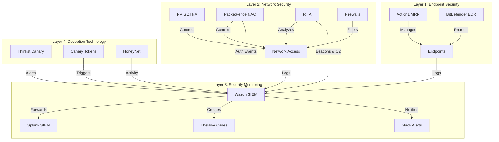

# OpenDiD: Open Source Defense-in-Depth Security Framework

OpenDiD is a battle-tested Defense-in-Depth security framework developed in a live production environment by a team of 30+ security professionals. It integrates essential security tools including EDR, SIEM, IDS, deception technology, and incident response platforms, providing a comprehensive security posture for organizations.

🛡️ Key Features:
• Complete integration flows and documentation
• Production-tested configurations
• Real-world deployment guides
• Automated incident response playbooks
• Comprehensive security workflows

⚠️ Note: This represents a real implementation that evolved through continuous learning and improvement. While not a finished product, it serves as a valuable reference for organizations building their security infrastructure.

Built with open-source tools and nonprofit licensing, OpenDiD demonstrates what's possible in building a robust security framework through community collaboration.

## Important Context & Disclaimer

This repository represents a real-world Defense in Depth (DiD) security implementation that was developed as part of a nonprofit organization's CI/CD journey. It's essential to understand several key aspects about this project:

### Project Evolution
- This was not a theoretical exercise but a live production environment that evolved through continuous learning and improvement
- The infrastructure grew organically as our team learned, adapted, and enhanced our security posture
- Documentation and implementations reflect real-world challenges, solutions, and iterations

### Team & Timeline
- Developed by a dedicated team of 30+ volunteer security professionals
- Each team member contributed 10+ hours weekly
- Project spanned approximately one year before the organization's dissolution
- Represents thousands of hours of collective security expertise and practical implementation

### Project Status
- This repository captures the state of our security infrastructure before the organization's dissolution
- While not "feature complete," it represents a robust, production-tested security foundation
- Contains valuable insights into building a comprehensive security stack from the ground up

### Technical Constraints
- As a nonprofit organization, we operated under specific constraints:
  * Utilized only open-source software or tools with nonprofit licensing
  * Focused on maximizing security value within resource limitations
  * Prioritized sustainable, maintainable solutions

### Learning Resource
This project serves as:
- A practical example of implementing Defense in Depth in a production environment
- A learning resource for organizations building their security infrastructure
- A starting point for similar security initiatives
- A real-world case study in security evolution

### Important Notes
- This is not a turnkey solution but a foundation to build upon
- Implementation details reflect specific organizational needs and constraints
- Security configurations should be adapted to your specific requirements
- Consider this a reference architecture rather than a final product

## Overview
A comprehensive, enterprise-grade security infrastructure implementing Defense-in-Depth principles with Zero Trust Architecture. This project demonstrates the implementation of a multi-layered security approach using industry-standard tools and best practices.

## Architecture

## Security Components

### 1. Endpoint Management & Security
- **Action1 MRR**: Remote management and automated deployment
- **BitDefender EDR**: Advanced threat detection and response
- **Configuration Management**: Automated compliance enforcement

### 2. Network Security
- **NVIS Zero Trust**: Software-defined perimeter
- **PacketFence**: Network Access Control (NAC)
- **RITA**: Network Traffic Analysis & Beacon Detection
- **Network Segmentation**: Role-based access control
- **Traffic Analysis**: Deep packet inspection

### 3. Security Monitoring & Response
- **Wazuh SIEM**: Central security monitoring
- **Splunk SIEM**: Advanced security analytics
- **TheHive**: Security orchestration and response
- **Slack Integration**: Real-time alerts and collaboration

### 4. Deception Technology
- **Thinkst Canary**: Network honeypots
- **Canary Tokens**: Document tracking
- **HoneyNet**: Deception network
- **Threat Intelligence**: Attack pattern analysis

## Features

### Zero Trust Implementation
- Device validation before network access
- Continuous trust evaluation
- Least privilege access control
- Identity-based security policies

### Threat Detection & Response
- MITRE ATT&CK framework alignment
- Automated incident response
- Threat hunting capabilities
- Real-time alert correlation

### Compliance & Reporting
- Regulatory compliance monitoring
- Automated compliance reporting
- Security metrics dashboard
- Audit trail maintenance

### Network Traffic Analysis
- **RITA Capabilities**:
  - Beacon detection
  - DNS tunneling detection
  - C2 traffic identification
  - Long connection analysis
  - Data exfiltration detection

### Network Access Control
- **PacketFence Features**:
  - BYOD management
  - Guest access control
  - 802.1X support
  - Role-based access
  - Device fingerprinting

## Security Layers

### Layer 1: Endpoint Security
- Automated software deployment
- Patch management
- EDR capabilities
- Device compliance enforcement

### Layer 2: Network Security
- Zero Trust architecture
- Microsegmentation
- Traffic monitoring
- Access control

### Layer 3: Security Monitoring
- Log aggregation
- Event correlation
- Incident response
- Threat intelligence

### Layer 4: Deception Technology
- Network honeypots
- Document tracking
- Deception network
- Attack pattern analysis

## Documentation
- [Alert Level Classification](./docs/alert-levels.md)
- [Deployment Guide](./docs/deployment.md)
- [Integration Guide](./docs/integration.md)
- [Security Workflows](./docs/security-workflow.md)
- [Incident Response](./docs/incident-response.md)

## Technical Implementation
- [Tool Configurations](./configs/)
- [Integration Scripts](./scripts/)
- [Automation Playbooks](./playbooks/)
- [Dashboards](./dashboards/)

## Skills Demonstrated
- Enterprise Security Architecture
- Zero Trust Implementation
- SIEM Configuration & Management
- Security Automation & Orchestration
- Incident Response Planning
- Compliance Management
- Security Tool Integration
- Alert Management & Triage

## Best Practices Implemented
- Defense in Depth
- Principle of Least Privilege
- Zero Trust Architecture
- Automated Response
- Continuous Monitoring
- Security Metrics & KPIs

## Future Enhancements
- [ ] Threat Intelligence Platform Integration
- [ ] Machine Learning-based Threat Detection
- [ ] Cloud Security Posture Management
- [ ] Container Security
- [ ] DevSecOps Integration
- [ ] Extended EDR Capabilities

## License
MIT License - See [LICENSE](LICENSE) for details
