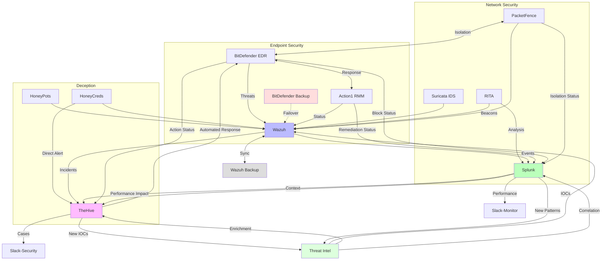
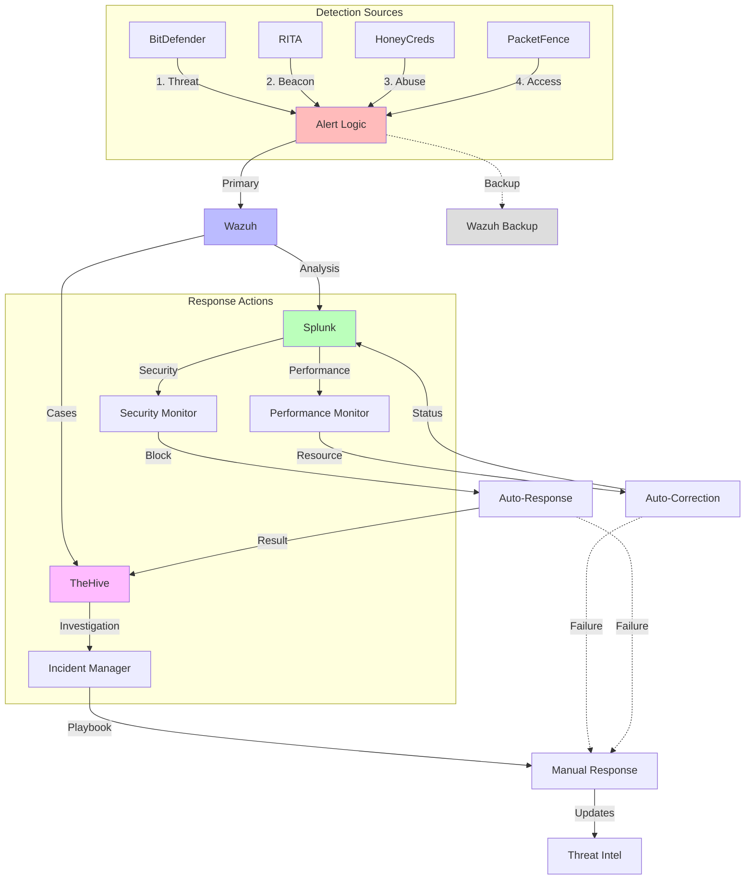
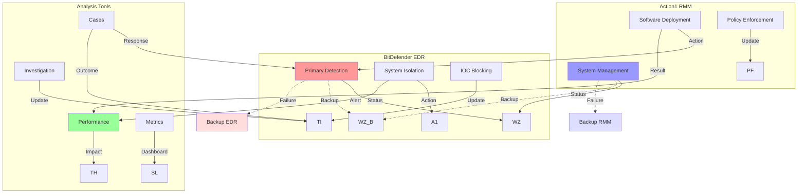
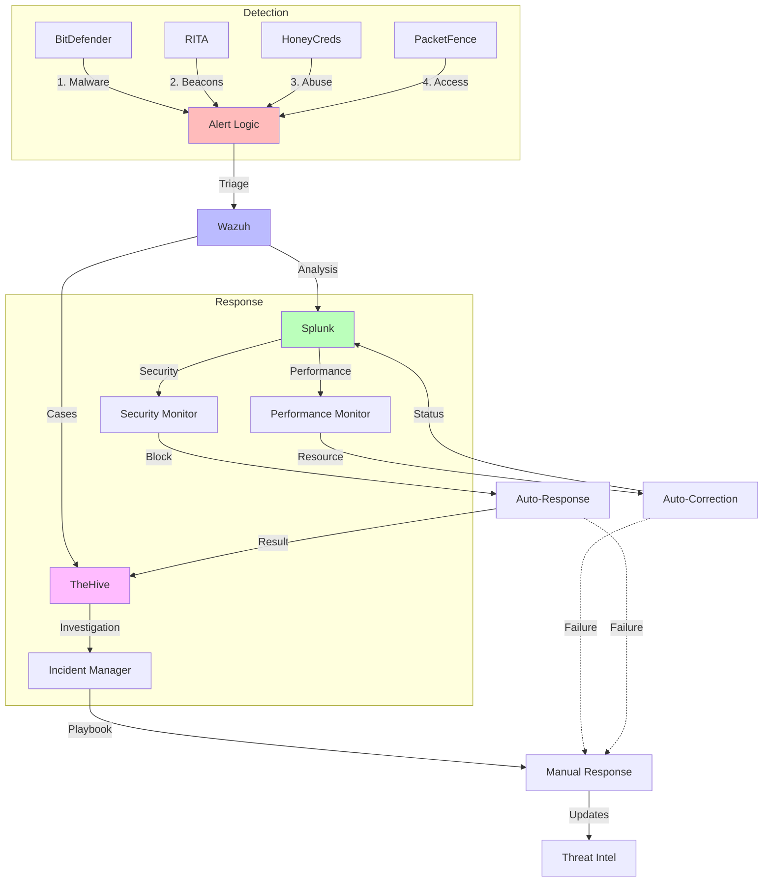
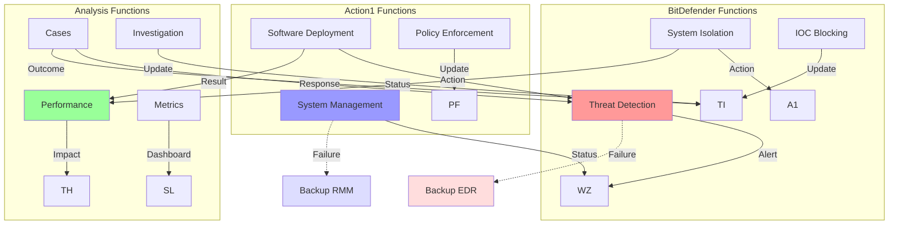
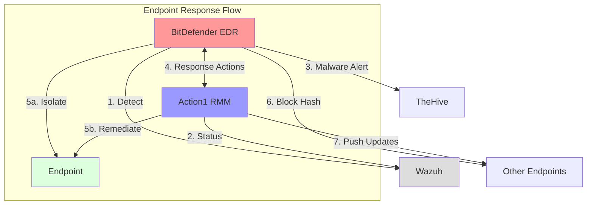
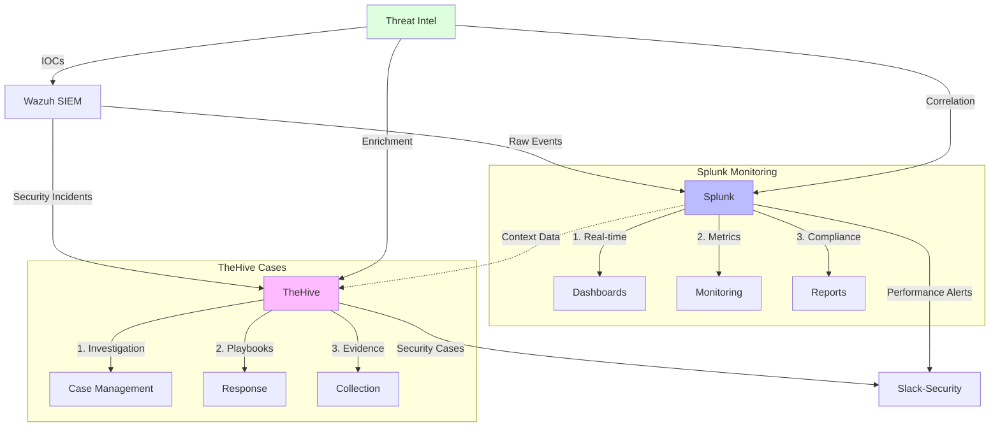
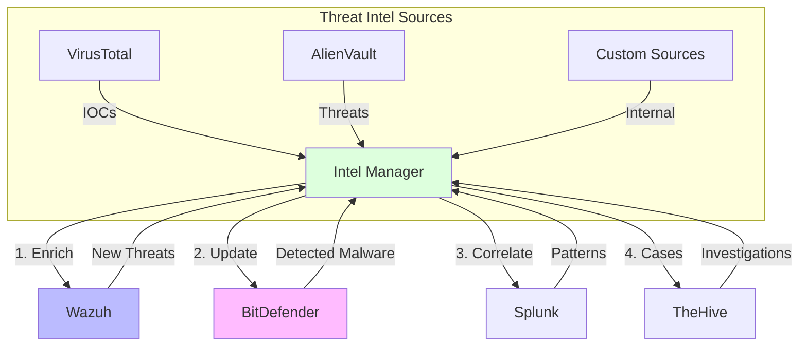

# Security Stack - Final Integration Flow

## 1. Core Integration Flow

## 2. Response Flow Matrix

## 3. Tool Integration Matrix

### Integration Details

1. **Primary Flows**:
   - Real-time detection and response
   - Automated remediation
   - Case management
   - Performance monitoring

2. **Feedback Loops**:
   - Action status reporting
   - Remediation verification
   - Pattern updates
   - Threat intel enrichment

3. **Failover Procedures**:
   - Redundant SIEM
   - Backup EDR
   - Alternative communication
   - Manual fallbacks

4. **High Availability**:
   - Active-passive SIEM
   - Redundant endpoints
   - Backup notification paths
   - Data synchronization

5. **Error Handling**:
   - Failed action escalation
   - Automatic failover
   - Manual intervention triggers
   - Status tracking

### Response Procedures

1. **Automated Actions**:
   - Primary response
   - Status verification
   - Failure detection
   - Automatic escalation

2. **Manual Actions**:
   - Escalated cases
   - Failed automation
   - Complex scenarios
   - Recovery procedures

3. **Feedback Processing**:
   - Action verification
   - Pattern updates
   - Rule refinement
   - Documentation updates

## 1. Complete Integration Flow

### BitDefender-Action1 Integration Details

1. **Detection & Response**:
   - BitDefender detects threats
   - Action1 executes remediation
   - Coordinated endpoint isolation
   - Automated system recovery

2. **Shared Capabilities**:
   - Endpoint inventory sync
   - Software deployment
   - Policy enforcement
   - System restoration

## 2. Alert Processing Matrix

### Alert Handling

1. **Initial Processing**:
   - Source-specific handling
   - Priority determination
   - Correlation check
   - Impact assessment

2. **Analysis Path**:
   - Performance Issues:
     * Resource monitoring
     * Impact analysis
     * Auto-correction
   - Security Issues:
     * Threat assessment
     * Auto-response
     * Case creation

3. **Response Flow**:
   - Automated:
     * Resource adjustment
     * Threat blocking
     * System isolation
   - Manual:
     * Investigation
     * Remediation
     * Recovery

## 3. Tool-Specific Integration

### Tool Integration Details

1. **BitDefender EDR**:
   - Threat detection → Wazuh
   - System isolation → Action1
   - IOC blocking → Threat Intel

2. **Action1 RMM**:
   - System management → Wazuh
   - Software deployment → BitDefender
   - Policy enforcement → PacketFence

3. **Analysis Tools**:
   - Splunk performance → TheHive
   - TheHive cases → BitDefender
   - Both → Threat Intel updates

## 4. Endpoint Integration (BitDefender & Action1)

### BitDefender-Action1 Integration Details

1. **Detection & Response**:
   - BitDefender detects threats
   - Action1 executes remediation
   - Coordinated endpoint isolation
   - Automated system recovery

2. **Shared Capabilities**:
   - Endpoint inventory sync
   - Software deployment
   - Policy enforcement
   - System restoration

## 5. Analysis Tools Integration

### Analysis Tool Distinction

1. **Splunk Focus**:
   - Real-time monitoring
   - Performance metrics
   - Compliance reporting
   - System health
   - Log analysis
   - Custom dashboards

2. **TheHive Focus**:
   - Security incidents
   - Case management
   - Investigation tracking
   - Evidence collection
   - Response coordination
   - Threat hunting

3. **Integration Points**:
   - Splunk provides context to TheHive
   - TheHive references Splunk data
   - Separate notification channels
   - Distinct use cases

## 6. Threat Intelligence Flow

### Threat Intel Integration

1. **Data Sources**:
   - External feeds (VirusTotal, AlienVault)
   - Internal discoveries
   - Partner sharing
   - Industry feeds

2. **Integration Points**:
   - Real-time IOC updates
   - Automated blocking
   - Threat correlation
   - Risk scoring

3. **Feedback Loop**:
   - Internal discoveries
   - Threat validation
   - Pattern updates
   - Custom rules

## 1. Complete Integration Flow

### Integration Details

1. **Primary Flows**:
   - Real-time detection and response
   - Automated remediation
   - Case management
   - Performance monitoring

2. **Feedback Loops**:
   - Action status reporting
   - Remediation verification
   - Pattern updates
   - Threat intel enrichment

3. **Failover Procedures**:
   - Redundant SIEM
   - Backup EDR
   - Alternative communication
   - Manual fallbacks

4. **High Availability**:
   - Active-passive SIEM
   - Redundant endpoints
   - Backup notification paths
   - Data synchronization

5. **Error Handling**:
   - Failed action escalation
   - Automatic failover
   - Manual intervention triggers
   - Status tracking

### Response Procedures

1. **Automated Actions**:
   - Primary response
   - Status verification
   - Failure detection
   - Automatic escalation

2. **Manual Actions**:
   - Escalated cases
   - Failed automation
   - Complex scenarios
   - Recovery procedures

3. **Feedback Processing**:
   - Action verification
   - Pattern updates
   - Rule refinement
   - Documentation updates
