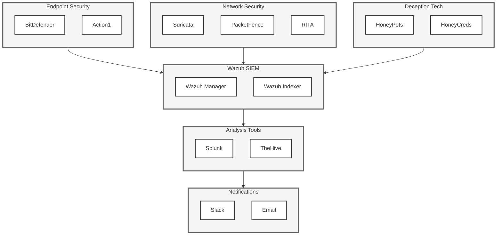
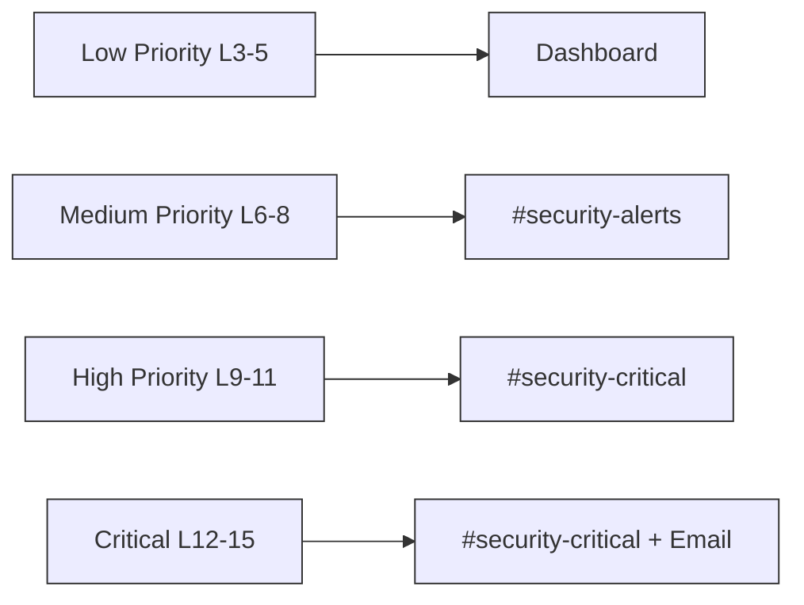
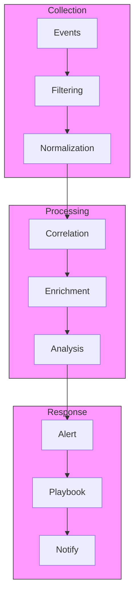

# Security Stack Integration Flow

```mermaid
flowchart TD
    %% Main Components
    EP[Endpoint Security] --> SIEM
    NET[Network Security] --> SIEM
    DEC[Deception Tech] --> SIEM
    SIEM[Wazuh SIEM] --> ANA[Analysis Tools]
    ANA --> NOTIFY[Notifications]

    %% Details for each component
    subgraph EP[Endpoint Security]
        direction TB
        BD[BitDefender]
        A1[Action1]
    end

    subgraph NET[Network Security]
        direction TB
        SU[Suricata]
        PF[PacketFence]
        RT[RITA]
    end

    subgraph DEC[Deception Tech]
        direction TB
        HP[HoneyPots]
        HC[HoneyCreds]
    end

    subgraph SIEM[Wazuh SIEM]
        direction TB
        WM[Wazuh Manager]
        WI[Wazuh Indexer]
    end

    subgraph ANA[Analysis Tools]
        direction TB
        SP[Splunk]
        TH[TheHive]
    end

    subgraph NOTIFY[Notifications]
        direction TB
        SL[Slack]
        EM[Email]
    end

    %% Styling
    classDef default fill:#fff,stroke:#333,stroke-width:2px;
    classDef group fill:#f5f5f5,stroke:#666,stroke-width:3px;
    class EP,NET,DEC,SIEM,ANA,NOTIFY group;
```

## Alert Level Flow

```mermaid
graph LR
    L1[Low Priority L3-5] --> D[Dashboard]
    L2[Medium Priority L6-8] --> S1[#security-alerts]
    L3[High Priority L9-11] --> S2[#security-critical]
    L4[Critical L12-15] --> S3[#security-critical + Email]

    classDef low fill:#green,stroke:#333;
    classDef med fill:#yellow,stroke:#333;
    classDef high fill:#orange,stroke:#333;
    classDef crit fill:#red,stroke:#333;
    classDef notify fill:#lightblue,stroke:#333;

    class L1 low;
    class L2 med;
    class L3 high;
    class L4 crit;
    class D,S1,S2,S3 notify;
```

## Data Flow Summary

```mermaid
graph TD
    subgraph Collection
        E[Events] --> F[Filtering]
        F --> N[Normalization]
    end

    subgraph Processing
        N --> C[Correlation]
        C --> E1[Enrichment]
        E1 --> A[Analysis]
    end

    subgraph Response
        A --> AL[Alert]
        AL --> P[Playbook]
        P --> NT[Notify]
    end

    classDef phase fill:#f9f,stroke:#333;
    class Collection,Processing,Response phase;
```
