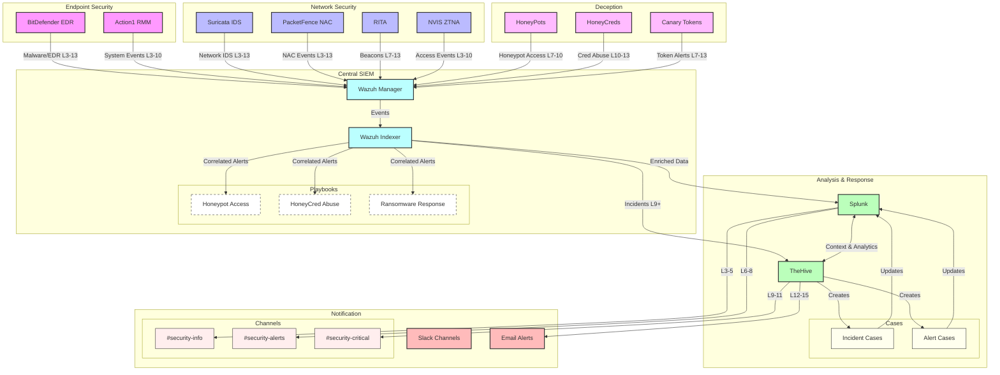

# Integration Flow

## Data Flow Diagram

## Alert Flow

1. **Data Collection (L3-13)**
   - **Endpoint Security**
     * BitDefender EDR: Malware, exploits, suspicious behavior
     * Action1 RMM: System events, patch status, compliance
   - **Network Security**
     * Suricata IDS: Network intrusions, protocol anomalies
     * PacketFence: Access control, device profiling
     * RITA: Beaconing, long connections, data transfer
     * NVIS: Zero-trust access events
   - **Deception Technology**
     * HoneyPots: Service access, interaction patterns
     * HoneyCreds: Credential usage, access attempts
     * Canary Tokens: Document access, credential use

2. **Central SIEM Processing**
   - **Wazuh Manager**
     * Event correlation
     * Threat intelligence matching
     * Initial alert triage
   - **Wazuh Indexer**
     * Event enrichment
     * Historical correlation
     * Threat hunting data
   - **Playbooks**
     * Honeypot Access Response
     * HoneyCred Abuse Response
     * Ransomware Response

3. **Analysis & Response**
   - **Splunk**
     * Advanced correlation
     * Threat hunting
     * Compliance reporting
     * Performance metrics
   - **TheHive**
     * Case management
     * Incident response
     * IOC management
     * Team coordination

4. **Notification Chain**
   - **Low Priority (L3-5)**
     * Channel: #security-info
     * Type: Dashboard updates
     * Frequency: Daily digest
   - **Medium Priority (L6-8)**
     * Channel: #security-alerts
     * Type: Real-time alerts
     * Frequency: As detected
   - **High Priority (L9-11)**
     * Channel: #security-critical
     * Type: Immediate alerts
     * Frequency: Real-time
   - **Critical (L12-15)**
     * Channel: #security-critical
     * Additional: Email alerts
     * Frequency: Immediate with acknowledgment

## Integration Points

### Wazuh → Splunk
- Real-time event forwarding via HEC
- Custom field mapping for correlation
- Alert enrichment with threat intel
- Automated response tracking

### Wazuh → TheHive
- Case creation for L9+ alerts
- Evidence attachment (logs, captures)
- Playbook triggering based on alert type
- Bi-directional status updates

### Splunk ↔ TheHive
- Incident context sharing
- Historical data correlation
- IOC extraction and sharing
- Response action tracking
- Performance metrics
