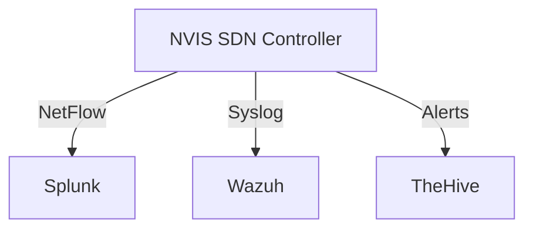
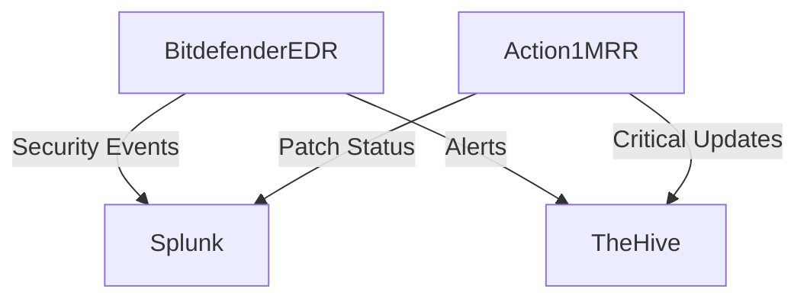
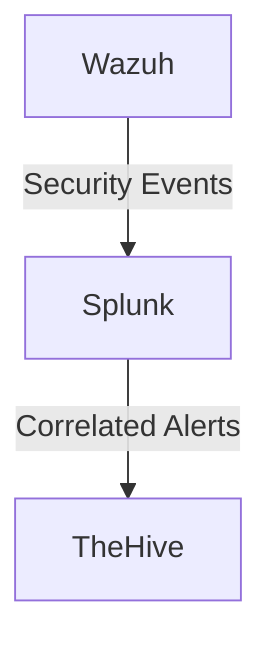

# Integration Guide

## Component Integration Overview

### 1. NVIS with SIEM Integration

### 2. Endpoint Security Integration

### 3. SIEM Integration

## Configuration Steps

### 1. NVIS Configuration
1. Configure network segments in `nvis-config.json`
2. Set up NetFlow export to Splunk
3. Enable syslog forwarding to Wazuh
4. Configure webhook integration with TheHive

### 2. Bitdefender EDR Setup
1. Deploy EDR agents using `edr-config.json`
2. Configure SIEM integration for Splunk
3. Set up alert forwarding to TheHive

### 3. Action1 MRR Integration
1. Apply configuration from `mrr-config.yaml`
2. Enable syslog forwarding to SIEM
3. Configure webhook notifications

### 4. SIEM Configuration
1. Configure Wazuh agents and manager
2. Set up Splunk forwarders
3. Create correlation rules
4. Enable TheHive integration

### 5. SOAR Implementation
1. Deploy TheHive using provided configs
2. Import incident response playbooks
3. Configure integrations with all components

## Authentication

Replace the following placeholders in configuration files:
- `[YOUR-API-KEY]`: API keys for respective services
- `[YOUR-IP]`: Server IP addresses
- `[YOUR-TOKEN]`: Authentication tokens
- `[YOUR-URL]`: Service URLs

## Network Requirements

| Source | Destination | Port | Protocol | Purpose |
|--------|-------------|------|----------|----------|
| NVIS | Splunk | 2055 | UDP | NetFlow |
| All | Wazuh | 514 | TCP/UDP | Syslog |
| All | Splunk | 8088 | TCP | HEC |
| All | TheHive | 9000 | TCP | API |

## Validation Steps

1. Verify NVIS network segmentation
2. Confirm EDR agent reporting
3. Test Action1 patch deployment
4. Validate SIEM log collection
5. Test incident response playbooks
