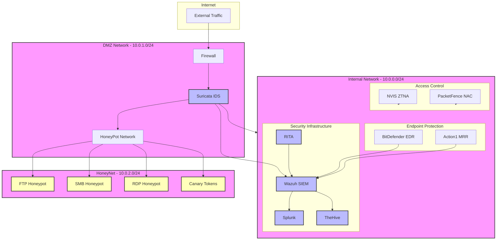

# Network Architecture

## Overview

## Network Segments

### DMZ Network (10.0.1.0/24)
- Suricata IDS for network monitoring
- Initial honeypot access points
- Firewall controls

### Internal Network (10.0.0.0/24)
- Security monitoring infrastructure
- Access control systems
- Endpoint protection management

### HoneyNet (10.0.2.0/24)
- Isolated honeypot network
- Deception technology
- Canary tokens

## Security Components

### Monitoring & Detection
- Wazuh SIEM: Central security monitoring
- Splunk: Log analysis and visualization
- RITA: Network traffic analysis
- Suricata IDS: Network intrusion detection

### Access Control
- NVIS ZTNA: Zero Trust access control
- PacketFence: Network Access Control

### Endpoint Security
- BitDefender EDR: Endpoint detection and response
- Action1 MRR: Remote management

### Deception
- HoneyPots: FTP, SMB, RDP services
- Canary Tokens: Tracking documents and credentials
