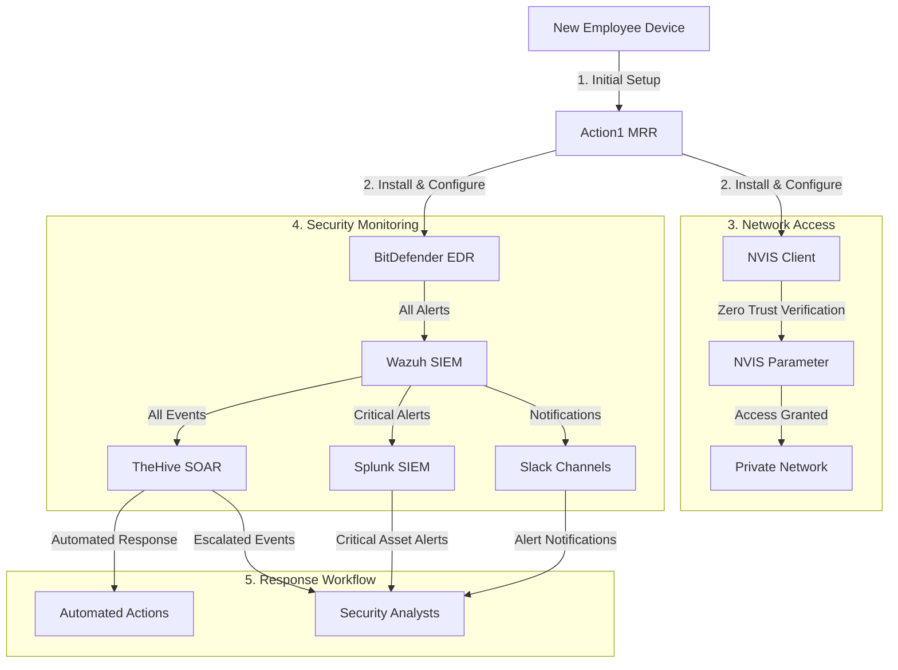

# Security Infrastructure Workflow

## Security Tool Chain

## Component Roles

### 1. Action1 MRR (Initial Security Control)
- Mandatory installation before device onboarding
- Manages software deployment and updates
- Ensures security baseline compliance
- Deploys BitDefender EDR and NVIS Client

### 2. NVIS Software Defined Parameter
- Implements Zero Trust architecture
- Controls access to private network
- Verifies device compliance status
- Integrates with Action1 and BitDefender for verification

### 3. BitDefender EDR
- Provides endpoint protection
- Monitors for threats and anomalies
- Sends all alerts to Wazuh SIEM
- Enforces security policies

### 4. Wazuh SIEM (Primary SIEM)
- Collects all security events
- Performs initial correlation and analysis
- Routes critical alerts to Splunk
- Forwards events to TheHive
- Sends notifications to Slack channels:
  - #security-critical: Level 12 alerts
  - #security-high: Level 10 alerts
  - #security-alerts: Level 5 and above

### 5. Splunk SIEM (Critical Asset Monitoring)
- Monitors critical assets only
- Receives critical alerts from Wazuh
- Provides advanced analysis capabilities
- Used by advanced security team

### 6. TheHive SOAR
- Processes all events before analyst review
- Performs automated response actions
- Manages incident workflow
- Integrates with all security tools

## Event Flow
1. All security events flow to Wazuh SIEM
2. Wazuh forwards to TheHive for automation
3. Critical alerts are sent to Splunk
4. Wazuh sends notifications to appropriate Slack channels
5. TheHive processes events before analyst review
6. Advanced team handles Splunk alerts

## Access Requirements
1. Action1 MRR installed and compliant
2. BitDefender EDR active and updated
3. NVIS client configured
4. Zero Trust verification passed
