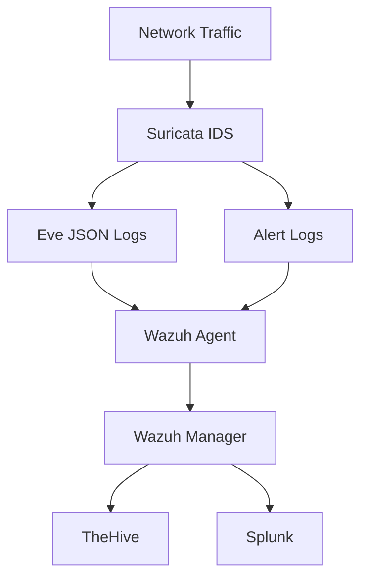

# Suricata IDS Setup and Configuration

## Overview
Suricata IDS is integrated into our Defense-in-Depth stack for network intrusion detection, focusing on honeypot monitoring and threat detection. It operates alongside RITA and PacketFence to provide comprehensive network security.

## Architecture


## Key Components

### 1. Network Monitoring
- Interface: eth0 (primary monitoring interface)
- Packet Capture: AF_PACKET with cluster_flow
- Performance: Optimized for medium-sized networks

### 2. Detection Rules
- Custom honeypot rules
- Emerging Threats ruleset
- Local rules for specific threats

### 3. Logging and Alerting
- EVE JSON format for comprehensive logging
- Alert-specific JSON output
- Stats logging for performance monitoring

## Integration Points

### 1. Wazuh SIEM
- Real-time alert forwarding
- Custom decoders for honeypot events
- Automated alert enrichment

### 2. TheHive
- Automated case creation
- Alert correlation
- Incident response tracking

### 3. Splunk
- Long-term log storage
- Advanced analytics
- Custom dashboards

## Performance Tuning

### Memory Management
```yaml
detect-engine:
  profile: medium
  custom-values:
    toclient-groups: 2
    toserver-groups: 2
```

### Network Buffer
```yaml
af-packet:
  - interface: eth0
    cluster-id: 99
    cluster-type: cluster_flow
    defrag: yes
    use-mmap: yes
    tpacket-v3: yes
```

## Maintenance Procedures

### Daily Tasks
1. Check Suricata service status
2. Monitor alert volumes
3. Review performance metrics

### Weekly Tasks
1. Update rulesets
2. Check for false positives
3. Tune detection thresholds

### Monthly Tasks
1. Review performance metrics
2. Update custom rules
3. Validate integrations

## Troubleshooting

### Common Issues
1. High CPU Usage
   - Check thread configuration
   - Review rule performance
   - Adjust buffer sizes

2. False Positives
   - Review rule thresholds
   - Update whitelist
   - Tune custom rules

3. Missing Alerts
   - Check network capture
   - Verify Wazuh integration
   - Review log settings

## Best Practices

### Rule Management
1. Use versioned rule files
2. Document custom rules
3. Regular ruleset updates

### Performance
1. Monitor system resources
2. Adjust thread settings
3. Use appropriate buffer sizes

### Security
1. Regular updates
2. Secure communication
3. Access control

## Metrics and Monitoring

### Key Performance Indicators
1. Alert response time
2. False positive rate
3. Detection coverage

### Health Checks
1. Service status
2. Log rotation
3. Integration status

## Recovery Procedures

### Service Failure
1. Stop Suricata service
2. Clear temporary files
3. Reset network buffers
4. Restart service
5. Verify operation

### Data Loss Prevention
1. Regular log backups
2. Redundant storage
3. Alert archiving
